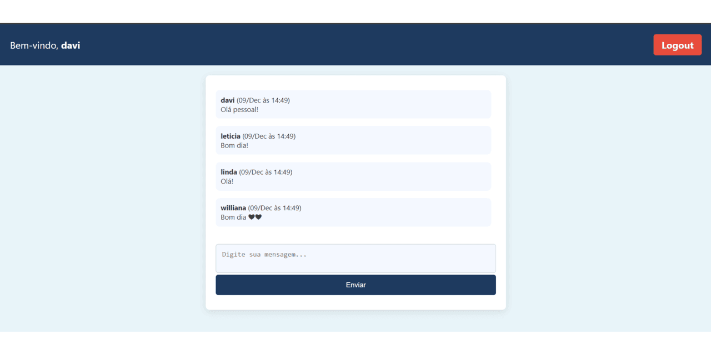
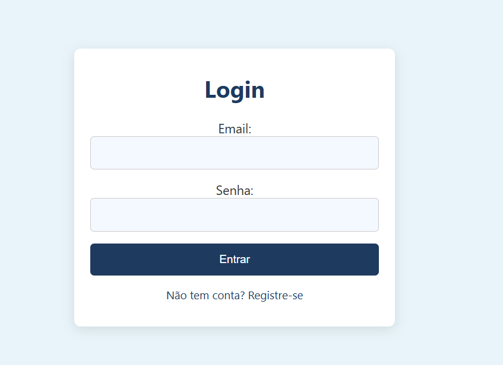
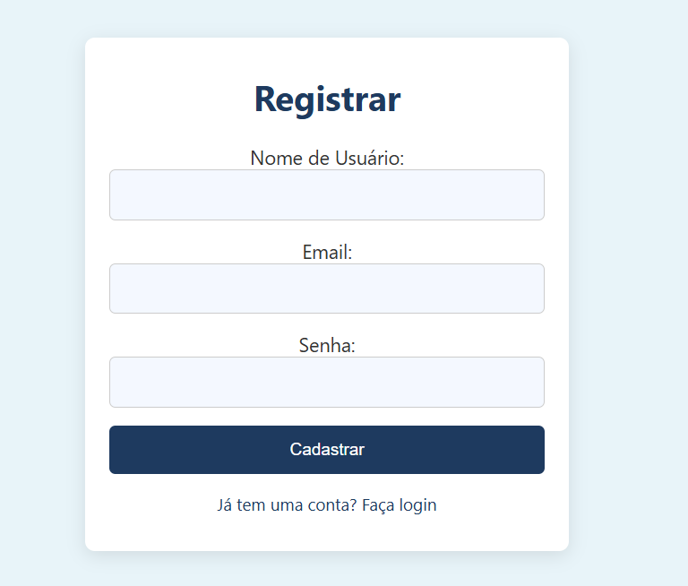

<h1>Sistema de Chat com Cadastro e Login</h1>
Este projeto é um sistema de chat online simples com funcionalidades de cadastro e login de usuários. Ele permite que os usuários se registrem, façam login e interajam em uma interface de chat em tempo real.

<h1>Funcionalidades:</h1>
Cadastro de usuários: Permite que novos usuários se registrem com um nome de usuário, email e senha. 
Login: Usuários podem fazer login com email e senha para acessar o chat. 
Chat: Após o login, os usuários têm acesso a uma interface de chat, onde podem enviar e visualizar mensagens. 
Sessão: A sessão do usuário é gerenciada durante a navegação, garantindo que apenas usuários autenticados possam acessar o chat. 
<h1>Tecnologias utilizadas:</h1>
PHP: Para o backend e lógica de autenticação.
PostgreSQL: Para o banco de dados, onde são armazenadas as informações de usuários e mensagens.
HTML/CSS: Para o frontend e a criação da interface de usuário.
JavaScript: Para interação e melhoria da experiência do usuário

